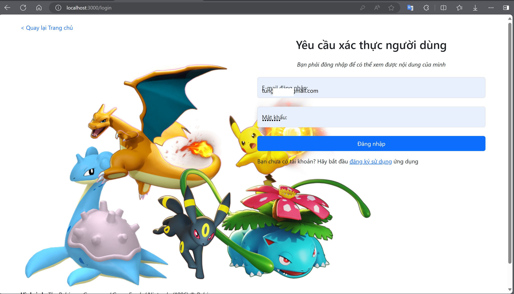
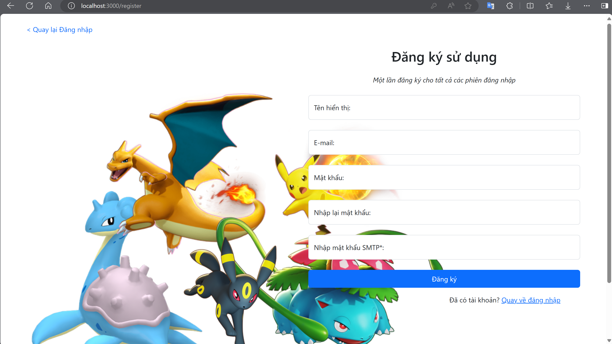
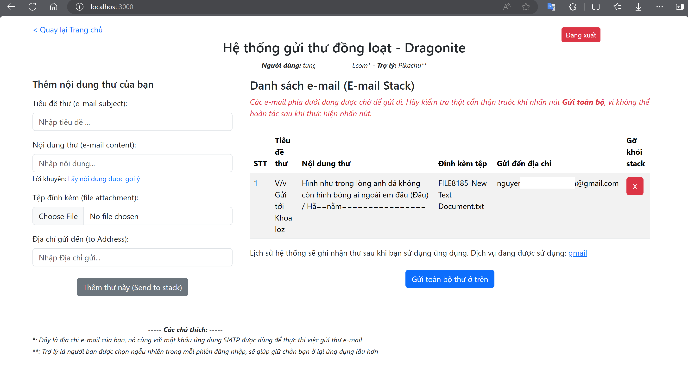
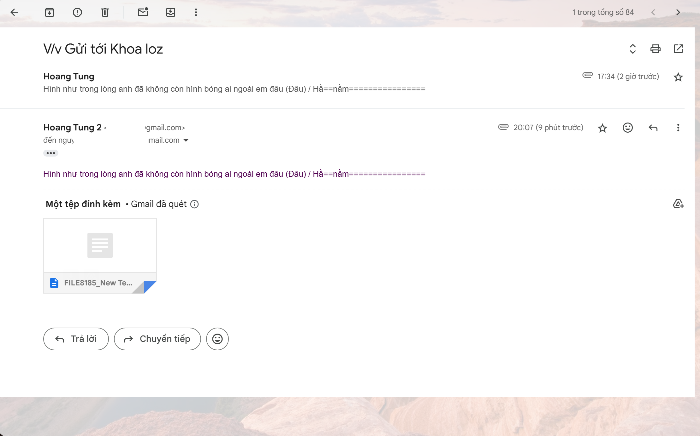
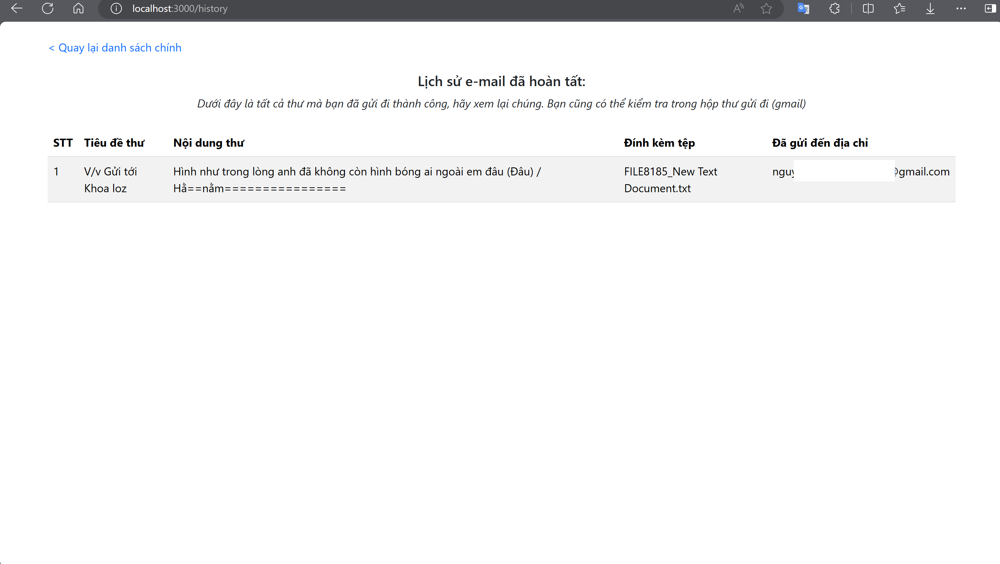
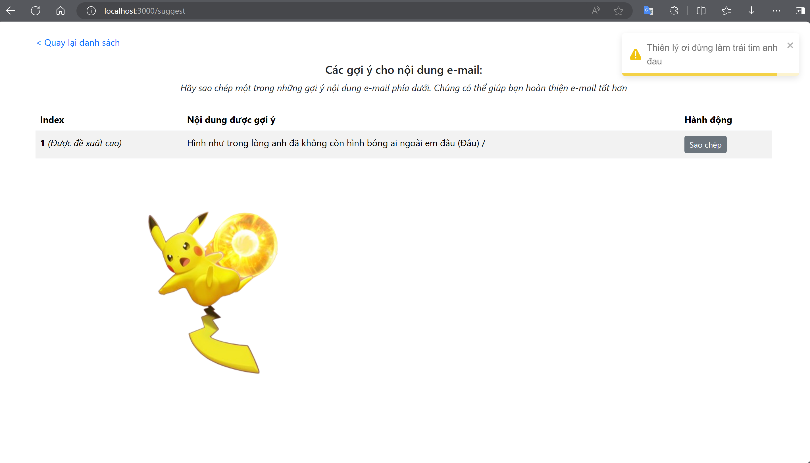

<h1>Dragonite - Một ứng dụng gửi thư điện tử đồng loạt với .NET Core và ReactJS</h1>
<h2>GIỚI THIỆU</h2>

<h6>Phiên bản: Beta - Giấy phép MIT License</h6>

Một hệ thống nhằm lưu trữ nhiều nội dung thư điện tử theo danh sách và cho phép gửi đi đồng loạt 

- Tác quyền:  

  - Hình ảnh & thương hiệu (Pokémon): The Pokémon Company / Game Freak / Nintendo (1996)  

  - Thiết kế ứng dụng & viết mã: Hoàng Tùng  
  - Kịch bản & thiết kế tệp README / tài liệu hướng dẫn: Hoàng Tùng   

 

- Chủ thể: Người dùng  
- Kiến trúc phần mềm: Kiến trúc phân tán (Distributed Architecture)  

 

<h2>CÁC CÔNG NGHỆ NỔI BẬT</h2>

1. <b> .NET Core </b>:  
- Tài liệu: https://learn.microsoft.com/en-us/aspnet/core/tutorials/first-web-api?view=aspnetcore-8.0&tabs=visual-studio  
- Tham khảo: ChatGPT (https://chat.openai.com/), StackOverFlow (https://stackoverflow.com/)   
2. <b> ReactJS</b>:  
- Tài liệu: https://react.dev/learn  
- Trang chủ: https://react.dev/  
- Tham khảo: ChatGPT (https://chat.openai.com/), StackOverFlow (https://stackoverflow.com/)  

<h2>CÁC TÍNH NĂNG NỔI BẬT</h2>
<h4>Phía Người dùng:</h4>

1. Đăng nhập, đăng ký, đăng xuất (Sử dụng JWT bearer-based authentication để xác thực và xử lý đăng nhập người dùng) 
2. Lưu lại các thư điện tử và gom chúng lại thành một danh sách, mỗi danh sách thuộc về từng người dùng khác nhau.  
3. Gửi đi đồng loạt các thư trong danh sách, sử dụng giao thức mạng SMTP và thư viện MailKit (https://github.com/jstedfast/MailKit). 

> Xem chi tiết [ở đây](##MÔ-TẢ-CHỨC-NĂNG)

## LUỒNG NGƯỜI DÙNG (USE-CASE)

` Với vai trò là một người dùng bình thường`

- Tương tự <a href="https://github.com/TrHgTung/Dragonite">https://github.com/TrHgTung/Dragonite</a>

   > Kỹ thuật SMTP: dùng MailKit.

- Tương tự <a href="https://github.com/TrHgTung/Dragonite">https://github.com/TrHgTung/Dragonite</a>

## MÔ TẢ CHỨC NĂNG

<h4>1. Xác thực người dùng:</h4>

<h4>2. Thêm và xem danh sách thư:</h4>

<h4>3. Gửi tất cả thư - đồng loạt:</h4>

<h4>4. Xem lịch sử gửi thư:</h4>

<h4>5. Xem đề xuất nội dung thư:</h4>

## MÔ TẢ KĨ THUẬT

- Back-end: ASP.NET Core phiên bản 8, thực hiện xử lý và gửi dữ liệu lên Front-end dưới dạng JSON. Các cú pháp truy vấn sử dụng phương pháp LINQ.
- Front-end: Lấy dữ liệu từ Back-end bằng cách sử dụng thư viện Axios với giao thức HTTP.
- Gửi E-mail: Sử dụng SMTP, với thư viện hỗ trợ chính là MailKit (khuyến khích các bạn sử dụng System.NET.Mail có sẵn ở các phiên bản mới hơn của .NET Core).
- Pop-up: Sử dụng Toastify (https://www.npmjs.com/package/react-toastify).

> Các response phía dưới tương ứng với các dữ liệu được hiển thị ở lần lượt các mục của phần [Mô tả chức năng](##MÔ-TẢ-CHỨC-NĂNG)

(Các thông tin nhạy cảm sẽ được ẩn đi)

<h4>1. Response đăng nhập:</h4>

{
"SMTP_pswrd": "ziukb\*\*\*\*dlgeyx",
"user": {
"id": 5,
"user_id": "USER_441120240717",
"display_name": "Hoang Tung 2",
"email": "tung\*\*\*\*@gmail.com",
"email_verified_at": null,
"smtp_password": "ziukb\*\*\*\*dlgeyx",
"created_at": "2024-07-17T12:58:47.000000Z",
"updated_at": "2024-07-17T12:58:47.000000Z"
},
"display_name": "Hoang Tung 2",
"token": "34|hlgwxDm04QFl29M8w\*\*\*\*tPp0fEqyvLV5nlmIK72ad8bd1"
}

<h4>2. Response đăng ký:</h4>

{
"user": {
"user_id": "USER_441120240717",
"email": "tung\*\*\*\*@gmail.com",
"display_name": "Hoang Tung 2",
"smtp_password": "ziuk\*\*\*\*dlgeyx",
"updated_at": "2024-07-17T12:58:47.000000Z",
"created_at": "2024-07-17T12:58:47.000000Z",
"id": 5
},
"token": "33|ExIsVi0WZ\*\*\*HjdwIKPB4UJyCqEVWSvX3df33fbd"
}

<h4>3. Đăng xuất:</h4>

- Xóa các giá trị được lưu trong Local Storage (dùng để kiểm tra phiên người dùng của các component)

<h4>4. Response thêm và lưu thư:</h4>

{
"data": [
{
"id": 39,
"mail_id": "MAIL_20240717_6466_USER_441120240717",
"user_id": "USER_441120240717",
"from": "tung****@gmail.com",
"to": "nguyentuanh****@gmail.com",
"attachment": "FILE8185_New Text Document.txt",
"subject": "V\/v G\u1eedi t\u1edbi Khoa loz",
"content": "H\u00ecnh nh\u01b0 trong l\u00f2ng anh \u0111\u00e3 kh\u00f4ng c\u00f2n h\u00ecnh b\u00f3ng ai ngo\u00e0i em \u0111\u00e2u (\u0110\u00e2u) \/ H\u1eb1==n\u1eb1m================",
"status": "n",
"time_sent": "2024-07-17"
}
],
"all_mails_sent": [],
"the_number_of_mail_sent": 0
}

<h4>5. Response gửi thư:</h4>

{"mail_status":"Gui e-mail thanh cong (200)"}

<h4>6. Response xem lịch sử:</h4>

{
"data": [],
"all_mails_sent": [
{
"id": 39,
"mail_id": "MAIL_20240717_6466_USER_441120240717",
"user_id": "USER_441120240717",
"from": "tung****@gmail.com",
"to": "nguyentua*****@gmail.com",
"attachment": "FILE8185_New Text Document.txt",
"subject": "V\/v G\u1eedi t\u1edbi Khoa loz",
"content": "H\u00ecnh nh\u01b0 trong l\u00f2ng anh \u0111\u00e3 kh\u00f4ng c\u00f2n h\u00ecnh b\u00f3ng ai ngo\u00e0i em \u0111\u00e2u (\u0110\u00e2u) \/ H\u1eb1==n\u1eb1m================",
"status": "y",
"time_sent": "2024-07-17"
}
],
"the_number_of_mail_sent": 1
}

<h4>7. Response xem đề xuất:</h4>

{
"data": [
"H\u00ecnh nh\u01b0 trong l\u00f2ng anh \u0111\u00e3 kh\u00f4ng c\u00f2n h\u00ecnh b\u00f3ng ai ngo\u00e0i em \u0111\u00e2u (\u0110\u00e2u) \/"
]
}

<h2>YÊU CẦU TRƯỚC KHI CÀI ĐẶT SOURCE</h2>

1. Trên máy tính (Test/Dev/Server) đã cài đặt Visual Studio (đã tích hợp môi trường để code .NET, tối thiểu .NET SDK), SQL Server và NodeJS  

2. Kiểm tra NodeJS đã được cài đặt hay chưa bằng lệnh `node -v` hoặc `node --version`  

3. Kiểm tra .NET Core đã được cài đặt chưa: `dotnet --info` hoặc `dotnet --version`  

<h2>CÁCH CÀI ĐẶT SOURCE</h2>

<h4>Với source .NET:</h4>

- Trong SQL Server Management Studio: Khởi động và đăng nhập vào SQL Server -> Tạo một cơ sở dữ liệu mới, đặt tên tùy ý  
- Trong Visual Studio:  
	+ Mở source với Visual Studio -> Build -> Build Solution  
	+ Cấu hình trong file appsettings.json: Kết nối với SQL Server bằng câu lệnh ConnectionString (https://learn.microsoft.com/vi-vn/ef/core/miscellaneous/connection-strings)  
	+ Thực hiện migration: Tools -> NuGet Package Manager -> Package Manager Console -> Chạy lệnh `dotnet ef database update`.  

<h4>Với source ReactJS (Front-end):</h4>

> Mở Terminal/Command Line: tại vị trí source DragoniteNET, chạy lệnh `cd ReactJS\dragonite` (Lí do: Source front-end nằm trong source back-end .NET Core =)))

1. Chạy lệnh `npm install` 
2. Ứng dụng sẽ chạy trên địa chỉ http://127.0.0.1:3000

<h2>CÁCH CHẠY SOURCE</h2>

<h4>Với source .NET (Back-end):</h4>

- Mở source với Visual Studio -> Start without debugging (chạy bằng dịch vụ IIS Express Server / http)

<h4>Với source ReactJS (Front-end):</h4>

1. Chạy lần lượt các lệnh: `cd ReactJS\dragonite` -> `npm start`  
2. Truy cập trong trình duyệt: http://127.0.0.1:3000 hoặc http://localhost:3000   

> <i>Fact</i>: http://127.0.0.1 chính là địa chỉ http://localhost 

<h2>CÁC LỖI PHÁT SINH</h2>

- Vui lòng không gỡ bỏ Mật khẩu ứng dụng Google trong quá trình debug, nếu tạo một Mật khẩu ứng dụng mới, đồng nghĩa với việc bạn phải tạo lại tài khoản test với địa chỉ e-mail và SMTP Password của bạn

 

<h2>Các tính năng khác</h2>

- Xếp hạng đề xuất cho nội dung thư: Sau mỗi lần được người dùng nhấn 'Sao chép' thì nội dung đó được tăng lên 1 điểm. Dữ liệu này được lưu trong bảng `suggestion` (CSDL)  

- Chọn trợ lý và hiển thị hình ảnh của trợ lý: Trong mỗi phiên đăng nhập, người dùng sẽ được ngẫu nhiên chọn lấy 1 trợ thủ (hành vi này được khởi tạo sau khi nhấn 'Đăng nhập' và các dữ liệu xác thực người dùng là chính xác, và được lưu vào localStorage với giá trị `assistant`). Sau đó, bằng phép so sánh điều kiện mà có thể hiển thị hình ảnh tương ứng của trợ lý trong trang `/suggest`

<h3>LIÊN HỆ VÀ DONATE</h3>

Các bạn nếu thích dự án này, mong muốn có thêm tính năng mới (mở rộng dự án) hoặc chỉ đơn giản là muốn donate cho tôi ☕☕☕; hãy liên hệ với tôi qua Telegram: <i>@trhgtung</i> hoặc comment tại video bất kỳ với nội dung bạn mong muốn trên kênh YouTube: <a href="https://www.youtube.com/@TungSupport">@TungSupport</a>

Xin cảm ơn! 😍😍😍

<h3>NẾU CÓ LỖI KHÁC XẢY RA / MUỐN ĐÓNG GÓP</h3>

- Các bạn muốn báo cáo lỗi: Hãy vào phần `Issues`

- Các bạn muốn đóng góp thêm tính năng: Hãy vào phần `Pull requests`

- Các bạn muốn báo cáo lỗi và tự sửa lỗi đó luôn: Thì làm như 2 mục trên 😆😆😆 và các bạn quá tuyệt vời 😎😎😎

> <i>Tại sao dự án có tên là Dragonite</i>?   
> ... Đây là tên của một loài Pokémon đưa thư và thân thiện với con người.  
